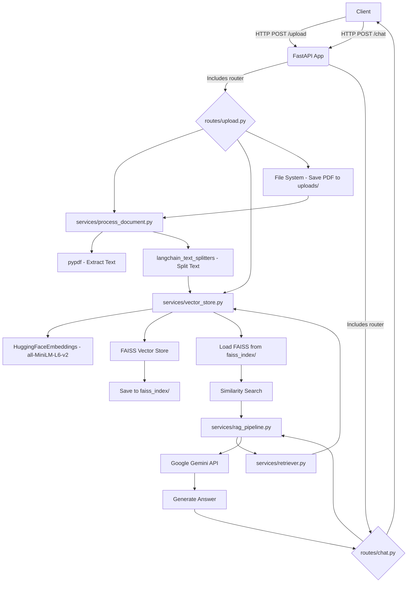

As a Senior Software Architect, I've analyzed the provided repository. Here's a comprehensive overview:

---

### 1. Project Overview

This project implements a Retrieval Augmented Generation (RAG) system using FastAPI, allowing users to interact with their uploaded PDF documents. The core functionality involves ingesting PDF files, processing their content into a searchable vector database, and then using a Large Language Model (LLM) to answer questions based on the document's content, augmented by retrieved relevant information from the vector store. It provides a simple API for document upload and conversational querying.

### 2. Tech Stack

*   **Backend Framework**: FastAPI (Python)
*   **PDF Processing**: `pypdf`
*   **Text Splitting**: `langchain_text_splitters` (RecursiveCharacterTextSplitter)
*   **Embeddings**: `langchain_community.embeddings.HuggingFaceEmbeddings` (model: `all-MiniLM-L6-v2`)
*   **Vector Database**: `langchain_community.vectorstores.FAISS`
*   **Large Language Model (LLM) Integration**: `google.generativeai` (Gemini-2.5-flash)
*   **Environment Management**: `python-dotenv`
*   **Data Validation**: `Pydantic` (for FastAPI request models)
*   **HTTP Server**: `uvicorn` (implicit for running FastAPI applications)
*   **CORS**: `fastapi.middleware.cors.CORSMiddleware`

### 3. Folder Structure

```
.
├── main.py
├── .env (expected for API key)
├── uploads/ (created at runtime, stores uploaded PDFs)
├── faiss_index/ (created at runtime, stores the FAISS vector store)
├── routes/
│   ├── __init__.py (implicit or explicit)
│   ├── chat.py
│   └── upload.py
└── services/
    ├── __init__.py (implicit or explicit)
    ├── process_document.py
    ├── rag_pipeline.py
    ├── retriever.py
    └── vector_store.py
```

### 4. Features

*   **PDF Document Upload**: Users can upload PDF files to the system.
*   **Automated Document Processing**: Uploaded PDFs are automatically processed:
    *   Text extraction from PDF pages.
    *   Text chunking into smaller, manageable segments for efficient retrieval.
*   **Vector Store Creation & Persistence**:
    *   Generates vector embeddings for document chunks using a local Hugging Face model (`all-MiniLM-L6-v2`).
    *   Creates a FAISS vector index from these embeddings.
    *   Persists the FAISS index to the local file system, allowing it to be loaded later for querying.
*   **Retrieval Augmented Generation (RAG)**:
    *   Retrieves top-k most relevant document chunks based on a user's query from the FAISS vector store.
    *   Augments a prompt with these retrieved chunks and the user's query.
    *   Sends the augmented prompt to the Google Gemini LLM to generate a contextualized answer.
*   **Conversational Interface**: Provides an API endpoint for users to submit natural language queries and receive answers based on the processed documents.
*   **CORS Support**: Configured to allow cross-origin requests from any origin, facilitating frontend integration.
*   **API Health Check**: A basic root endpoint to check the application's status.

### 5. Setup Instructions

To set up and run this project, follow these steps:

1.  **Clone the repository:**
    ```bash
    git clone <repository_url>
    cd <repository_name>
    ```

2.  **Create a virtual environment (recommended):**
    ```bash
    python -m venv venv
    source venv/bin/activate  # On Windows: venv\Scripts\activate
    ```

3.  **Install dependencies:**
    The project uses several libraries. Create a `requirements.txt` file (if not already present) with the following content, then install:
    ```
    fastapi
    uvicorn
    pypdf
    langchain-text-splitters
    langchain-community
    google-generativeai
    python-dotenv
    pydantic
    ```
    ```bash
    pip install -r requirements.txt
    ```
    *(Note: `langchain` library might be needed for older versions of `langchain-text-splitters` or `langchain-community`, but the specific imports suggest these modular packages are sufficient.)*

4.  **Set up environment variables:**
    Create a `.env` file in the root directory of the project and add your Google Gemini API key:
    ```
    GEMINI_API_KEY="YOUR_GEMINI_API_KEY"
    ```
    You can obtain a Gemini API key from the Google AI Studio or Google Cloud Console.

5.  **Run the application:**
    ```bash
    uvicorn main:app --reload
    ```
    The application will typically run on `http://127.0.0.1:8000`.

### 6. API Endpoints

The FastAPI application exposes the following endpoints:

*   **`GET /`**
    *   **Description**: A simple health check or home endpoint.
    *   **Response**: `{"status": "ok"}`

*   **`POST /upload`**
    *   **Description**: Uploads a PDF file, processes its content, converts it into embeddings, and stores them in a FAISS vector database.
    *   **Method**: `POST`
    *   **Request Body**: `File` (multipart/form-data)
        *   `file`: The PDF file to be uploaded.
    *   **Response**:
        ```json
        {
            "message": "File processed and stored in vectorDB",
            "chunks": <number_of_chunks_created>
        }
        ```

*   **`POST /chat`**
    *   **Description**: Accepts a natural language query and generates an answer by retrieving relevant information from the stored documents and using a Gemini LLM.
    *   **Method**: `POST`
    *   **Request Body**: `application/json`
        ```json
        {
            "query": "Your question here based on the uploaded documents."
        }
        ```
    *   **Response**:
        ```json
        {
            "query": "Your question here based on the uploaded documents.",
            "answer": "The generated answer from the LLM based on the retrieved context."
        }
        ```

### 7. Architecture Overview

The system follows a typical client-server architecture with a RAG pipeline on the backend.

1.  **Client Layer**: A client application (e.g., a web frontend, Postman, curl) interacts with the FastAPI backend via HTTP requests.

2.  **API Layer (FastAPI `main.py`, `routes/*.py`)**:
    *   Handles incoming HTTP requests.
    *   Routes requests to appropriate handlers (`/upload`, `/chat`, `/`).
    *   Manages middleware such as CORS for cross-origin communication.
    *   Deserializes request bodies (e.g., `ChatRequest` Pydantic model) and serializes responses.

3.  **Service Layer (`services/*.py`)**: This layer encapsulates the core business logic and interactions with external components.

    *   **Document Ingestion Pipeline (Triggered by `POST /upload`)**:
        a.  **File Storage**: The uploaded PDF is temporarily saved to the `uploads/` directory.
        b.  **Document Processing (`process_document.py`)**:
            *   `extract_text_from_pdf` (using `pypdf`): Extracts raw text content from the PDF.
            *   `split_text` (using `RecursiveCharacterTextSplitter`): Divides the extracted text into smaller, overlapping chunks.
        c.  **Vector Store Management (`vector_store.py`)**:
            *   `create_vector_store`: Takes the text chunks, generates embeddings for each chunk using `HuggingFaceEmbeddings` (model: `all-MiniLM-L6-v2`), and constructs a FAISS index from these embeddings.
            *   `save_vector_store`: Persists the created FAISS index to the local file system in the `faiss_index/` directory, allowing it to be loaded for future queries without re-processing.

    *   **Retrieval Augmented Generation (RAG) Pipeline (Triggered by `POST /chat`)**:
        a.  **Query Handling (`rag_pipeline.py`)**: Receives the user's `query`.
        b.  **Document Retrieval (`retriever.py`)**:
            *   `load_vector_store`: Loads the previously saved FAISS index from `faiss_index/`.
            *   `similarity_search`: Performs a similarity search on the loaded FAISS index using the user's query to find the `k` most relevant document chunks (context).
        c.  **Prompt Engineering (`rag_pipeline.py`)**: The retrieved `context` and the original `query` are combined into a structured prompt, guiding the LLM to answer based *only* on the provided context.
        d.  **LLM Interaction (`rag_pipeline.py`)**: The prepared prompt is sent to the Google Gemini LLM (`gemini-2.5-flash`) via the `google.generativeai` client.
        e.  **Response Generation**: The LLM processes the prompt and generates a natural language answer, which is then returned to the client.

4.  **Storage Layer**:
    *   **File System**: Used for storing uploaded PDF files (`uploads/`) and the persistent FAISS vector index (`faiss_index/`).
    *   **Environment Variables**: Managed via `.env` file for sensitive data like API keys.

This architecture clearly separates concerns into API routing, business logic (services), and external integrations (LLM, vector store, PDF library), making it modular and relatively easy to understand and maintain. The use of a local embedding model and FAISS vector store provides a self-contained and performant solution for document-based RAG.

